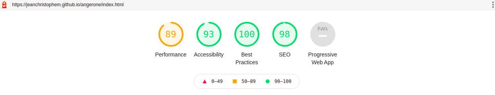
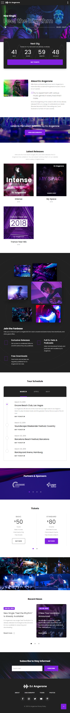

# DJ ANGERONE -> MAX & JC

Welcome to this repository.

We were tasked by DJ Angerone to make his new website.
You can find the deployed version [HERE](https://jeanchristophem.github.io/angerone/index.html)

The creators are [Jean-Christophe Molhant](https://github.com/JeanChristopheM) & [Kouznetsov Maxim](https://github.com/coreinside5).

The exercice was part of our formation at [BeCode Liège](https://github.com/becodeorg/).

We started working hard on the 06th of October and gave the website back on the 13th of October.

Almost all assets were provided but we had to improvise on a few details as well as the animations.

Here is the last lighthouse results we got : 

The design we were give looks like this : 

